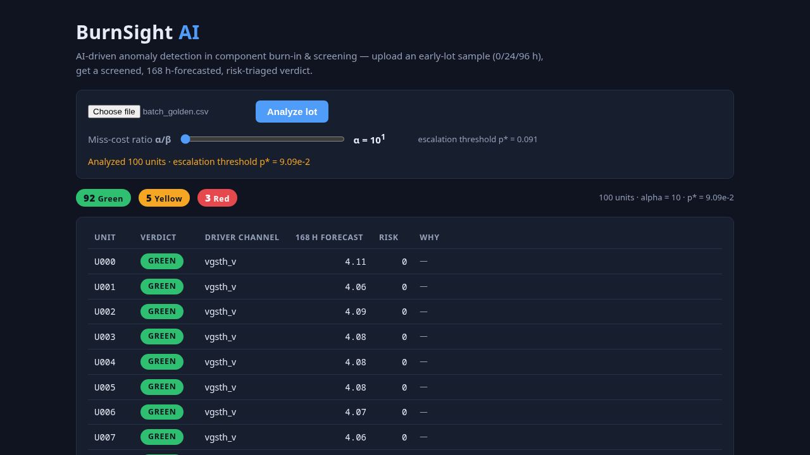
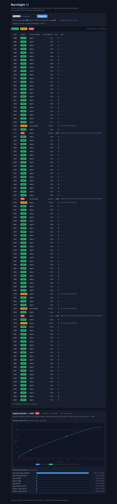
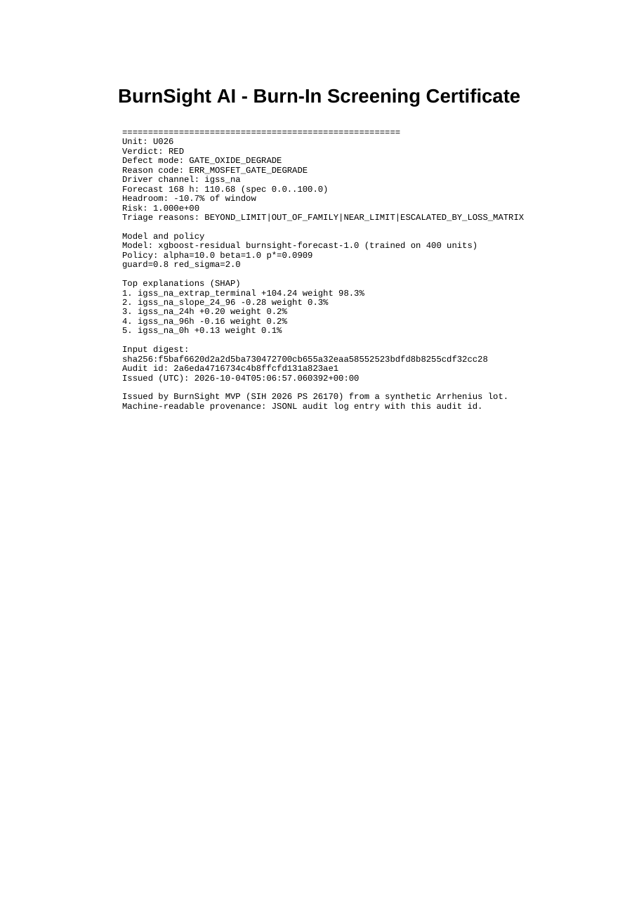
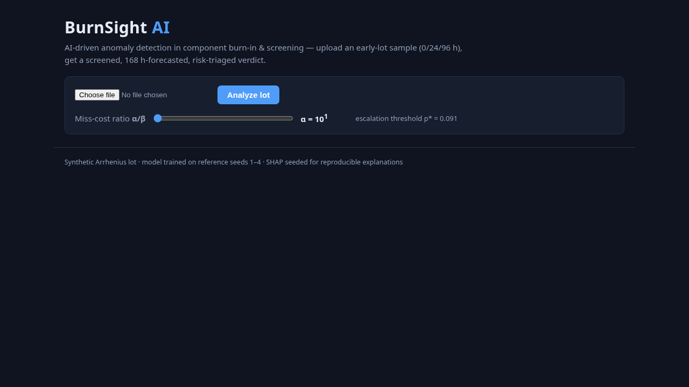

# BurnSight


**Early burn-in telemetry screening that forecasts 168-hour component health and triages Green/Yellow/Red risk before the burn-in cycle ends.**

SIH 2026 problem statement **PS 26170** — *AI-Driven Anomaly Detection in Component Burn-In & Screening* (ISRO). Built as a one-day TDD MVP: eight tickets, red tests first, code review at every boundary. The sprint plan and decision log live in [PLAN.md](PLAN.md).

## Overview

BurnSight is a software-only screening platform for high-reliability microelectronics qualification. It ingests early-burn-in parametric telemetry (0h, 24h, 96h), detects out-of-family components against the batch population, forecasts terminal 168-hour parameter states, and assigns asymmetric risk triage with explainable, auditable reasoning.

| Principle | What it means in practice |
|---|---|
| **Physics-grounded** | Arrhenius temperature normalization and semiconductor failure-mode reasoning bound every forecast; MIL-STD-883 terminology is used throughout. |
| **Asymmetric by design** | The risk engine penalizes False Negatives (escaped defects) tenfold against False Positives (yield loss), matching space-grade zero-defect requirements. |
| **Explainable and auditable** | Every decision carries SHAP feature attribution, a physics-grounded reason code, and a machine-readable audit record. |
| **Software-only** | CSV and JSON telemetry in, decisions and certificates out. No test hardware, no chamber integration. |

## Why BurnSight

Standard burn-in screening stresses components for 168 continuous hours before aerospace payload assembly, but qualification decisions still rely on static pass/fail thresholds applied at the end of the cycle. Two failure modes dominate:

- **Catastrophic escape** — a part stays inside static specification limits at 168h despite abnormal drift kinetics during early hours, then degrades in orbit.
- **Yield and capacity loss** — every part runs the full 168 hours, and benign process variation triggers false alarms under rigid limits, discarding expensive space-grade components.

BurnSight targets the first hours of the cycle: population outlier screening, terminal-value forecasting, asymmetric triage, and audit-grade explanations — so QA teams can reject early, extend selectively, and document every decision.

## What's implemented

All eight MVP tickets shipped (see [PLAN.md](PLAN.md) for the ticket-by-ticket log):

| Capability | Module | Notes |
|---|---|---|
| Synthetic Arrhenius burn-in generator | `generator.py` | Seeds 1–4 train, seed 42 holds out; 3 defect modes + 5 borderlines per 100-unit lot |
| CSV/JSON ingestion with schema + spec-limit validation | `ingest.py`, `schema.py` | Machine-readable error codes (400/415/422) |
| Population outlier screening (MAD ×2 + IsolationForest) | `screen.py` | Baseline and 0→96h drift families unioned |
| 168h degradation forecast (XGBoost residual over physics extrapolation) | `forecast.py` | Held-out MAE: 0.68 mΩ / 0.61 nA / 0.023 V |
| Asymmetric Green/Yellow/Red triage (`LossMatrix`, α=10·β) | `triage.py` | Near-limit guard ∪ outlier ∪ beyond-limit ∪ risk escalation |
| SHAP explainability + physics reason codes | `explain.py` | Top-ranked feature names the planted defect driver; codes like `ERR_MOSFET_GATE_DEGRADE` |
| Static dashboard (upload → badges → chart → explanation) | `frontend/`, `pipeline.py` | Plain HTML/JS/CSS, vendored Chart.js — no build tooling |
| Append-only JSONL audit log + PDF certificates | `audit.py` | sha256 input digest, model/policy version, ReportLab 5.0.1 |

**Honest scope notes:** training and evaluation data is synthetic (generator implements the Arrhenius kinetics model — no external dataset download); everything runs on CPU (an NVIDIA GPU is available but unused); thermal-IR fusion, PINN training, and PDF crypto signing were explicitly out of scope.

## Installation

Python ≥ 3.14, Linux.

```bash
git clone https://github.com/Siddhesh-ai-del/burnsight-ai
cd burnsight-ai
python3 -m venv .venv && source .venv/bin/activate
pip install -e ".[explain,forecast,certificate,test]"
```

The extras install SHAP (explainability), XGBoost (forecasting), ReportLab (certificates), and the test stack. Without extras you still get ingestion and screening.

## Run

```bash
uvicorn burnsight.api:app --port 8000
# open http://127.0.0.1:8000/
```

API without a browser:

```bash
# full pipeline: screen -> forecast -> triage -> explain -> audit record
curl -F "file=@data/samples/batch_golden.csv" \
     "http://127.0.0.1:8000/api/triage?alpha=10" | jq '.counts, .audit_id'

# machine-readable audit record + PDF certificate for a Red unit
curl "http://127.0.0.1:8000/api/audit/<audit_id>" | jq '.model, .policy'
curl -OJ "http://127.0.0.1:8000/api/certificate/<audit_id>/U026"
```

## 90-second demo

1. **Upload** — choose `data/samples/batch_golden.csv`, click **Analyze lot** (~6 s; the first run also trains the reference model once).
2. **Badges** — 100 units resolve to **92 Green / 5 Yellow / 3 Red** with per-unit driver channel, 168h forecast, risk, and reason string.

   
3. **Explain** — click Red **U026 ▸**: reason code `ERR_MOSFET_GATE_DEGRADE`, driver trajectory (measured 0/24/96h points, forecast curve crossing USL=100 between 96–120h, spec limits), and SHAP bars with `igss_na_extrap_terminal` carrying 98.3% of the attribution.

   
4. **Slider** — drag the miss-cost ratio (α/β): the threshold p\* updates and triage re-runs server-side.

   
5. **Certificate** — in the Explain panel, **⬇ Certificate (PDF)** downloads a ReportLab certificate rendered from the append-only audit log; the **audit JSON ↗** link shows the stored record (input digest, model/policy version, decisions, explanations, timestamp).

   



## Architecture

One Python process. No distributed infrastructure, no frontend build step.

```
CSV/JSON upload
      │
      ▼
ingest (schema + spec limits) ─────► screen (MAD baseline ∪ MAD drift ∪ IsolationForest)
      │                                       │
      ▼                                       │
features (0/24/96h, Arrhenius AF)             │
      ▼                                       │
forecast = physics extrapolation              │
        + XGBoost residual correction ────────┤
      ▼                                       ▼
triage: BEYOND_LIMIT ∪ OUT_OF_FAMILY ∪ NEAR_LIMIT ∪ risk>p*   (LossMatrix α/β)
      │
      ├─► Green / Yellow / Red ──► frontend dashboard (Chart.js)
      ├─► explain: SHAP + reason codes ──► Explain panel / certificate content
      └─► append-only JSONL audit ──► GET /api/audit/{id} · GET /api/certificate/{id}/{unit}
```

Key decisions are logged rather than implied: **D1** (Stage-1 screening unions three detectors because a T=0h baseline alone has 0/3 recall on planted defects) and **D2** (the near-limit guard measures USL headroom — nearest-limit would misfire on healthy leakage near LSL=0).

## Testing

```bash
pytest tests/ --cov=burnsight --cov-report=term
# 182 passed, 99% statement coverage
```

Tests assert predictive behavior, not plumbing: precision/recall on planted defects, forecast MAE and leakage checks, FN-safety of triage, SHAP attributions naming the planted driver, and byte-exact append-only audit writes.

## Repository layout

```
burnsight-ai/
├── burnsight/            # the service (api, ingest, screen, forecast, triage, explain, audit, pipeline)
├── frontend/             # plain HTML/JS/CSS + vendored Chart.js (no build tooling)
├── tests/                # 182 tests, 99% coverage
├── data/samples/         # golden + edge-case upload fixtures
├── docs/images/          # dashboard screenshots
├── PLAN.md               # sprint plan, decisions, progress log
└── .github/              # issue templates, CODEOWNERS, PR template
```

## Project status & backlog

The MVP is feature-complete against [PLAN.md](PLAN.md); public APIs may still change before 0.1.0. Known issues are tracked openly as the post-MVP backlog: [#1–#8](https://github.com/Siddhesh-ai-del/burnsight-ai/issues) — mainly function-length refactors (findings from the per-ticket code reviews) plus two robustness items (dashboard innerHTML hardening, audit-log file locking).

## Contributing

See [CONTRIBUTING.md](CONTRIBUTING.md) for bug reports, feature proposals, and the test-driven development and coverage standards this repository requires.

## Security

See [SECURITY.md](SECURITY.md) for vulnerability reporting. Please do not open public issues for security reports.

## Support

See [SUPPORT.md](SUPPORT.md) for where to get help.

## License

This project is licensed under the Apache License 2.0 — see [LICENSE](LICENSE).
